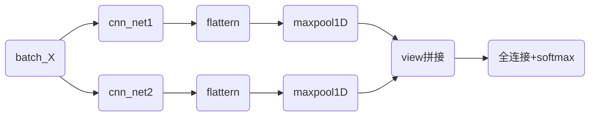
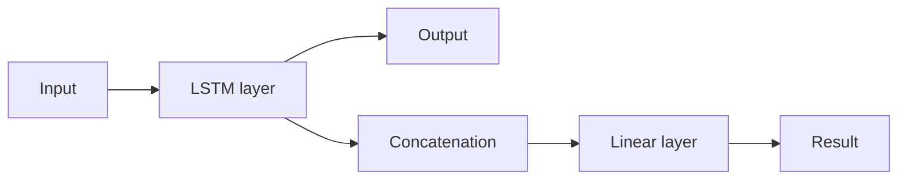

# 人智导实验报告

郭高旭 ggx21@mails.tsinghua.edu.cn 2021010803

- [作业仓库]([Ggx21/IAI2 (github.com)](https://github.com/Ggx21/IAI2))
- [pytorch学习笔记]([Dive-into-DL-PyTorch (ggx21.github.io)](https://ggx21.github.io/2023/05/03/notes/pytorch/learn_torch/))
- [代码文件](https://cloud.tsinghua.edu.cn/f/91b9791557cb4e1f9821/)


本次实验实现了下面的module

| 模型名称         | 测试准确率 | 测试f值 |
| ---------------- | ---------- | ------- |
| CNN_simple       | 83.46%     | 0.8322  |
| CNN_complex      | 81.75%     | 0.8167  |
| RNN              | 82.54%     | 0.8247  |
| DenseNet         | 75.95%     | 0.7546  |
| ResNet           | 77.43%     | 0.7725  |
| LSTM             | 80.21%     | 0.8010  |
| BiLSTM           | 81.68%     | 0.8158  |
| GoogLeNet        | 74.40%     | 0.7367  |
| MLP              | 70.94%     | 0.7047  |
| MLP_with_Dropout | 74.82%     | 0.7464  |

## 0.实验流程

### 文件结构图

```apl
D:.

│  dataprocess.py#------数据预处理
│  DLongpu.py#-----------main.py
│  module.py#---储存,调用module的类
│  
├─Dataset#提供的数据
│      test.txt
│      train.txt
│      validation.txt
│      wiki_word2vec_50.bin
│      word_freq.txt 
├─input#预处理后的数据
│      test_input.pkl
│      train_input.pkl
│      validation_input.pkl
│      word2vec.pkl
│          
├─module#储存的模型
│      BiLSTM.pkl
│      CNN_complex.pkl
│      CNN_simple.pkl
│      ...
|
├─plot#生成的图片
│      all_acc_F1.png
|		...
```

### 执行过程

#### 一.数据预处理:**DataProcesser**()类

1. 构建词表vocab:
   - 取得词频表,保留出现频率高于treshold(我取了10,一共获得8072个词)的词
   - 为词频表中的词建立索引
   - 对于词频表中每一个词,利用提供的转换文件,转换为50维词向量(如果转换表中没有这个词,我的做法是随机一个,实际上由于我们只保留了一定出现频率的词,没有出现过的词占比很少,对结果影响不大)
2. 读取句子:
   - 读取句子,记录label与commet
   - 通过索引,将comment从词列表转化为索引列表(如果没有索引,转换成pad_char对应的id,这里把中性词"把"作为pad_char)
   - 统一句子长度:
     - 通过统计手段,97.5%的评论次数在96个词以内,统一句子长度为96(当然也可以是别的长度)
     - 超过96的句子则截断
     - 低于96的句子,我的操作是重复这个句子直到长度为96.(另一种方法是填充pad_id,但是要注意不要训练pad_id)
3. 转换为词向量
   - 在构建词表时已经完成了索引,根据词的索引找到词向量即可.

**DataProcesser**使用方法,执行该类示例的`run`方法即可.最终生成了`input`文件夹下转换成词向量列表的句子.(分别有训练集,测试集,验证集,和word2vec的索引)

#### 二.获得模型**GetModule**()类

module.py文件中定义了**GetModule**()类,它会调用参数`module_name`对应的模型,并用我调整过的参数初始化这个模型,对于某些模型起到adapter的作用,对输入加以处理,使得可以在主函数中使用统一的输入模式而不加以修改.可以在module.py文件中方便地注册更多的模型

#### 三.主函数DLongpu.py

主要是定义了**PredictClass**()

1. 通过上述**GetModule**()初始化自己的模型(包括了对应的*损失函数和优化器*)
2. 读取预处理的数据,并通过pytorch的Dataset和Dataloader准备好数据
3. 开始训练epoch次数
   1. 分batch训练：将训练数据随机划分为多个batch，每个batch被输入到模型中进行训练。(Dataloader的功能)
   2. 正向传播：将当前batch的数据输入到模型中，进行正向传播计算得到输出结果。
   3. 计算loss：根据输出结果和标签，计算模型的损失函数（loss）。
   4. 反向传播：根据损失函数，使用链式法则计算每个参数的梯度，然后传回模型中更新参数，以减小损失函数。
   5. 重复迭代：重复以上步骤直到所有batch都被训练过一遍，一个epoch训练结束。
   6. 训练结束后开启eval模式,利用验证集对效果进行验证
4. 训练结束后展示在测试集的效果
5. 储存模型

实际上,可以通过main函数中的Mode标签,切换成test模式,读取已经储存的模型.

此外,还可使用**PredictClass**()中的real_test方法,利用了jieba分词对用户真实的输入进行预测.经过我的实验,效果还挺不错的.


​	效果还是不错的

## 1.模型的结构图


下面分别介绍模型的结构图

- #### CNN_simple

  ```mermaid
  graph TB
      A(batch_X) -->|Conv2d| C(Batch,通道数=卷积核数目,)
      C -->|BatchNorm2d| D(Batch,对每一通道数据归一化处理)
      D -->|ReLU,MaxPool2d|F(Batch, kernel_num, 1, 1)
      F -->|View| G(Batch, kernel_num将输出拼接起来)
      G -->|Dropout| H(Batch, kernel_num)
      H -->|Linear and Softmax| I(全连接,将输出长度变为2,并对输出softmax)
  ```
  


注意我和课本不同的是我使用了n个相同大小卷积核,在池化的时候由于卷积后仍是2维,所以是二维的最大池化(图源课件ppt,稍作修改)

#### CNN_complex

使用了ppt中原始cnn模型前半部分作为一个模块cnn_net





1. *将两个形状是(批量大小, 词数, 词向量维度)的嵌入层的输出按词向量连结*
2. *根据Conv1D要求的输入格式，将词向量维，即一维卷积层的通道维(即词向量那一维)，变换到前一维*
3. *对于每个一维卷积层，在时序最大池化后会得到一个形状为(批量大小, 通道大小, 1)的* *Tensor。*
4. 拼接在一起后通过全连接层得到输出

#### RNN(我的实现也就是单层的LSTM)



具体结构解释：

- 输入：输入数据，形状为 $batch \times seq\_length \times embed\_size$ 
- LSTM layer：包含多层LSTM的编码器，将输入数据序列传入编码器后，得到输出序列和最终时间步的隐藏状态 -
-  输出：输出序列 $output\_seq$，形状为 $seq\_length \times batch \times num\_hiddens$
-   Concatenation：将最终时间步的隐藏状态 $h$ 和初始时间步的隐藏状态 $c$ 沿最后一个维度拼接起来，形状为 $batch \times 2*num\_hiddens$ 
-   Linear layer：线性层，将拼接后的向量输入，输出一个二元向量 
-   Result：模型的输出，输出层的结果，形状为 $batch \times 2$


其中depth为1,如果在torch中设置`bidirectional==true`,可以得到双向RNN

#### MLP


很多层的全连接+激活函数.

激活函数是必要的,否则多层会退化为单层


#### GoogLeNet

主要是inception模块


串联多个inception模块,最后池化+全连接

#### DenseNet\ResNet等不再画出,完全参照ppt

## 2.实验结果

- #### 所有模型最终在测试集上表现的结果.


​	可以看见CNN,RNN都达到了f值高于0.8的要求	

- 所有模型训练准确率随epoch的变化

  

- 所有模型训练f值随epoch的变化

  

  本题给的数据中正负标签的比例差不多,而且我的模型看上去对正负完全不敏感.所以最终f值的计算结果和准确率差别不大.

- 所有模型训练f值随epoch的变化

  

处于对计算力和时间的综合考虑,还有对我可怜的1650的保护,我选取的epoch比较小(16)可以看见各种模型的loss值仍有下降趋势,在对单个模型的测试过程中,增加epoch数确实可能增加训练准确率,减小loss.但有的模型已经出现比较明显的过拟合现象

- 所有模型验证准确率随epoch的变化

  

- 所有模型验证准确率随epoch的变化

  

  明显地,在验证集上,随epoch增加,准确率并不一定增加,甚至不升反降

## 3.使用的不同参数效果，并分析原因

## 4.不同模型之间的简要比较

- 在我对每个模型分别进行测试时,达到最高效果的实际上是CNN-complex模型
- 我实现的CNN,RNN模型确实在测试时表现比Baseline模型(MLP模型)强
- 但是MLP模型在训练集上的表现非常好,很快到达了95%+
- 认为MLP模型太容易过拟合,因此给他加上几个dropout,确实有点用,在测试集上表现略有变好
- 在我没有实现MLP的时候,实验表明我DenseNet,GoogleNet等几个复杂模型过拟合程度比较高
- 但是最简单的MLP的训练与测试表现差异反而最大.

## 5.问题思考

- #### 实验训练什么时候停止是最合适的？

  **Early Stop**:理论上讲可以通过验证集动态调整停止时间,在验证集效果达到最好时就停止训练.操作上可以在验证集几轮epoch都没有增长时停止.

  但是earlystop有几个问题:

  - 比较复杂,不方便我实验框架下统一的实现.

  - 有时候模型准确率会突变,比如googleNet

    

    所以我最终采用了固定epoch数的方式.

    但是实际上几个我调过参数模型在epoch数为40左右表现最好

- #### 实验参数的初始化是怎么做的？

  - 模型的参数基本上是pytorch默认方法.

  - 例如：nn.Linear 和 nn.Conv2D，都是在 [-limit, limit] 之间的均匀分布（Uniform distribution），其中 limit 是 $1. / sqrt(fan_{in}) ，fan_{in}$ 是指参数张量（[tensor](https://so.csdn.net/so/search?q=tensor&spm=1001.2101.3001.7020)）的输入单元的数量。

  - 此外对于RNN可以考虑正交初始化（Orthogonal Initialization）

    主要用以解决深度网络下的梯度消失、梯度爆炸问题，是在RNN中经常使用的参数初始化方法。`nn.init.orthogonal`但实际上差别没有感觉

- ####  有什么方法可以方式训练过程陷入过拟合。

  下面是按照我实验中的效果明显程度排序

  1. 选取更加合适的模型:

     这个是

  2. 调整epoch,在合理时机停止

  3. 增加dropout层,调整dropout概率

     看baseline模型,认为MLP模型太容易过拟合,因此给他加上几个dropout,确实有点用,在测试集上表现确实略有变好.但是对其他比较复杂的模型来说,dropout影响有限

  4. 参数正则化

     计算loss时添加正则化项

     ```python
     
                 L1_reg = 0
                 for param in self.module.parameters():
                      L1_reg += torch.sum(torch.abs(param))
                 loss += 0.001 * L1_reg  # lambda=0.001
     ```

     这样可以惩罚某些较大的参数.按照我的理解就是防止考试偏科.

     但实在是没什么用

  5. 调整参数.

     dropout\learning-rate等等都会影响过拟合

  6. 增加训练集大小

     一个操作是可以通过k-折,将原有训练集与验证集合并后随机分成k份.这样可以增加训练集大小

  7. 动态停止epoch

  8. 动态调整

  ## 6.试分析CNN，RNN，全连接神经网络（MLP）三者的优缺点。

多层感知机在单层神经网络的基础上引入了一到多个隐藏层（hidden layer）。隐藏层位于输入层和输出层之间。

如果把CNN的核的大小看成和输入一样,那么实际上MLP可以看作是CNN的一个特例.

- MLP

  - 全连接神经网络（MLP）的优点在于比较简单,它可以捕捉到输入数据的非线性关系，能够应用于各种领域。
  - 参数较多,单层计算起来比较复杂,容易过拟合...正则化等技术在MLP上的效果比较好
  - 单层只能表示一个维度的信息.对空间的敏感性不如CNN

- RNN

  - 对于序列数据的处理具有很强的能力，尤其在语音识别、自然语言处理和语音合成等任务中表现优异。
  - RNN具有记忆能力，它可以传递信息并保留之前输入的状态，从而在处理时序信息时取得较好的效果。

  - RNN的缺点在于，训练复杂度高，而且受梯度消失/爆炸问题的限制，其在长序列的语音和自然语言任务中表现可能较差。

- CNN

  - 单层计算量比全连接小
  - 参数共享和稀疏交通,能够以较小的计算和储存成本生成大量参数。
  - 可以捕捉到多个层级的特征,比如宽高.对空间敏感性更好,因此常常应用在计算机视觉中
  - 但是CNN还是有两个非常危险的缺陷：平移不变性和池化层。我的理解是CNN对位置太敏感了,一个卷积核的神经元识别一只猫,猫动一动就认不出来了.池化层虽然可以一定程度上削弱这个问题,但是带来了数据信息丢失等新问题.

## 7.实验心得

- 利用五一假期,我从零认真学习了一波pytorch,所有的心得体会记录在了我的[这篇博客]([Dive-into-DL-PyTorch (ggx21.github.io)](https://ggx21.github.io/2023/05/03/notes/pytorch/learn_torch/))里
- 感觉这个实验解释性实在是有点低,哪个参数更好,哪个模型更好,什么层可以解决什么问题,基本上还是要靠实验.书本的知识往往并不一定适用
- [作业仓库]([Ggx21/IAI2 (github.com)](https://github.com/Ggx21/IAI2))